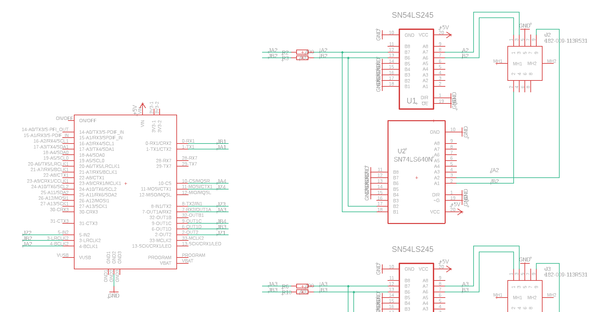

# Industrial 3D Printer
*__Big 3D printer made with industrial parts from an injection molding machine__*

### Introduction

This is a 3D printer made with an extruder from an injection moulding machine and Motors and axis from several old ATM CNC robots. It will be using an material dryer and a mini vacuum conveyor for supplying the extruder with material. It will be build such that the extruder only moves on one axis because of its weight (approximately 50kg). The extruder will be moved on the x-axis and the bottom plate will be moved on the z- and y-axis. The software will be Marlin which is going to run on a Teensy 4.0. Then octoprint will be used as an Marlin host to control. Here octoprint will run on a Raspberry Pi 4.0 with an 15" industrial grade touch screen.


### Motor control

The motors are controlled by lenze servo controllers. All of the servo drives and the power management are already packed in a nice cabinet. This will be reused. Here the teensy will be sitting inside this cabinet. The model of the servo controllers is Lenze 9300. Here the X9 and X10 connectors will be used as seen here:


*Figure 1: Page 47 of lenze 9300 servodrive manual*

*__Lenze manual:  [BA_9300_Register_control_EN.pdf](/md_attachments/BA_9300_Register_control_EN.pdf)__*

Here the X9 connector is digital frequency input. This input requires a TTL encoder signal. Then the servo drive will mimic this encoder signal. This way the drive can be controlled. So the Teensy 4.0 will input the Marlin stepper signals to this input. The plan is to have 4 outputs on the teensy that, so the X,Y,Z,W axisses can be controlled. Here the W axis is the motor that turns the extruder. Another nice feature this allows is that the servo drives can easily be daisy chained if multiple motors is needed per axis by connecting the X10 and X9. 

To make connecting the inputs to the Teensy 4.0, a circuitboard is going to be made with 4 d-sub connectors. Here is the current state of the board drawing and schematic:


*Figure 2: Board*



*Figure 3: Here is seen a piece of the schematic*

As seen in figure 2, non-inverting- and inverting bus-trancievers are used to unload the teensy's output GPIO pins. The reason the inverting bus-trancievers are used is because the input signal is differential as seen in figure 1. 

The reason why the stepper output of Marlin can be connected directly to the TTL encoder signal of the X9 input is because the signals are identical as seen by comparing Figure 1 and Figure 4 below:


*Figure 4: Here is seen the stepper output marlin*

Here it should be noted that the Z signal is not nescessary to use, so it will not be used. The z signal just signifies when the encoder has turned one revolution. This will not be relevant though since all stepping amounts will be calibrated in marlin at last.


#### The cable between X9 and X10

As seen in figure 1 there are specific requirements for the specific leaders in the cable that is going to run between x9 and x10. Here there have been chosen a 9-conductor cable at 0.5mm2. The connectors are going to be female-female, so there have been chosen some 9-pin d-sub connectors. The links for the parts can be seen here:

Cable: [Link](https://dk.rs-online.com/web/p/yy-kabel/1811780/)

D-sub Connector: [Link](https://dk.rs-online.com/web/p/d-sub-stik/5443749/)

D-sub Connector House: [Link](https://dk.rs-online.com/web/p/d-sub-bagkapper/5444039/)


### Octoprint with Raspberry Pi 4.0

Here as mentioned in the introduction Octoprint will be running on the raspberry pi. Here the raspberry pi will be connected to the Teensy via serial and a 15" touch screen will be connected to the Raspberry. The screen used will be this: [Link](https://www.beetronics.dk/15-tommer-touchskaerm-metal-4-3). The reason this HMI is used is because the ease of use that octoprint offers and future expansion of functionality is easy.

#### Camera in octoprint

Here a Sony QX1 will be mounted on the printer to monitor the printing process. The QX1 already outputs a mjpeg stream over its own network. So here the raspberry pi will be connected to the QX1's network. and input the stream into octoprint. In the future this functionality will be expanded to sending trigger commands to the QX1 to take pictures so octolapse can be integrated. Here a problem arises if the raspberry pi is to be connected to wifi and controlled remotely. To solve this problem either a WiFi dongle will be connected or the ethernet port on the raspberry will be used. A power adapter will here be used to power the qx1 constantly. This power adapter can be seen here: [Link](https://www.subtel.dk/index.php?cl=details&offerId=3978956963&lang=6&anid=915664&cnid=192d2e4a1f71bd07ce1a5f9bbb185e09&campaign=dk-pla/Netzteil/915664&gclid=Cj0KCQiAs5eCBhCBARIsAEhk4r6M4nEBqRl9llAmq8cqiiVEmtkUiZZ6ZFrAzY_FEcEVpPGQpeQw50saAnzREALw_wcB)

##### Camera commands so far to get live-view

For saving the liveview this command have been used on MacOS for now:

```bash
ffmpeg -i http://192.168.122.1:8080/liveview/liveviewstream -vcodec flv -qscale 1 -an output.flv
```


### Mechanical composition

Here as said before the extruder is going to be moved in the X-axis and the bottom plate is going to be moved in the Y- and Z-axis. This is seen in Figure 5 below:


*Figure 5: Here is seen an example of how the axis will look*

Here it should be noted that although the axis placements are correct on the image. The way the axisses are moved are not. This image is just to show axis placement. The Z-axis is not moving the extruder it should here be moving the bottom plate instead. The reason why the extruder is placed on the x-axis is because of its sheer size and weight. Here it will be advantagous only to move it from side to side to minimize movement of mass. To make the x-axis move the weight of the extruder, the long axis of the ATM CNC robot is going to be used. This is because this has lots of already built-in support and can therefore support the extruder with ease. It also has place for motor mounting, gear and gearrack for moving the axis, and a cable carrier. This i going to be very advantageus for running the material supply line for the extruder, motor cables for x and w axisses, and heating element wires for extruder. Everything will then be mounted on a steel frame made out of welded steel beams. The material of the bottom plate is being researched, so the best material can be found. For now the material is aluminium, but that could also be replaced with borosilicate glass because of its hardness and temperature resistance


### Material Supply and Processing

Here as said in the introduction a mini vacuum conveyer will be mounted on the extruder. Its material line, will then be run through the cable carrier and down to a material dryer which will be drying the material, so it has minimal moisture for fine prints. The mini vacuum conveyer in question is here the Conradt by Andertech as seen in this attachment: [CONRADT.pdf](md_attachments/CONRADT.pdf). The dryer in question is not found yet. The heating elements of the extruder will be powered by some sort of heat control elements. Preferably ones that can be controlled by software, so the temp can be controlled in the octoprint interface. But if this is out of the budget or simply not possible, conventional heat control elements will be used.


### Temperature Control

To control the temperature of the 6 heating bands on the extruder and the heating pads on the bottom plate, a PID controller will be made using a Raspberry Pi 3, 8 thermalcouple amplifiers and 8 solid-state relays. The outputs to the solid-state relays will be with PWM, so the temperature control is more precise. Then the Raspberry Pi 3 will run a webserver where temperature data can easily be requested and changes via POST and GET requests. This way the Raspberry Pi 4 running octoprint can request and change temperatures easily.


### Bill of Materials

| Name                                         | Quantity |                             Link                             | Price (DKK) |
| :------------------------------------------- | :------: | :----------------------------------------------------------: | :---------: |
| Conradt mini vacuum conveyer                 |    1     |                                                              |    4000     |
| ILCE-QX1 Power adapter                       |    1     | [Link](https://www.subtel.dk/index.php?cl=details&offerId=3978956963&lang=6&anid=915664&cnid=192d2e4a1f71bd07ce1a5f9bbb185e09&campaign=dk-pla/Netzteil/915664&gclid=Cj0KCQiAs5eCBhCBARIsAEhk4r6M4nEBqRl9llAmq8cqiiVEmtkUiZZ6ZFrAzY_FEcEVpPGQpeQw50saAnzREALw_wcB) |     259     |
| 15" Touch screen                             |    1     | [Link](https://www.beetronics.dk/15-tommer-touchskaerm-metal-4-3) |    2699     |
| Cable                                        |    1     |   [Link](https://dk.rs-online.com/web/p/yy-kabel/1811780/)   |     589     |
| Connector                                    |    16    |  [Link](https://dk.rs-online.com/web/p/d-sub-stik/5443749/)  |    6.376    |
| Connector house                              |    16    | [Link](https://dk.rs-online.com/web/p/d-sub-bagkapper/5444039/) |    27.22    |
| Material dryer                               |    1     |                                                              |     NaN     |
| SN74LS640N                                   |    6     | [Link](https://www.ti.com/store/ti/en/p/product/?p=SN74LS640N) |    9.54     |
| SN74ABT245BN                                 |    6     | [Link](https://www.ti.com/store/ti/en/p/product/?p=SN74ABT245BN) |    4.52     |
| Aluminium bottom plate                       |    1     |                                                              |     NaN     |
| Heating elements bottom plate                |    1     |                                                              |     NaN     |
| Steel frame                                  |    1     |                                                              |     NaN     |
| Mounting adapter for servo motor to extruder |    1     |                                                              |     NaN     |

So here the price comes up to: 8169kr. DKK for now. Here it should be noted that this is not close to the final cost, since the mounting brackets, the steel frame, and the aluminium bottom plate will cost a lot. 

